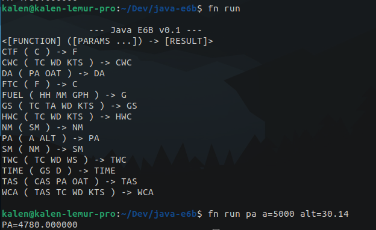

# Java E6B
## Overview
*Flight planning at the command line!*



A command line interface E6B flight computer written in the Java programming
language for general aviation flight planning. Currently in available as a
source code pre-release alpha.  

Pull requests and peer review are welcome!

## Disclaimer
This is currently a pre-release version! If you are using this tool for flight
planning please check your results with your own calculations before flying. No
calculation provided by this program is to be used as the sole source of
flight planning calculations until version 1.0.

## Technology
### Runtime Dependencies
[Java](https://www.java.com/en/download/manual.jsp)

### Used for development
[Java JDK 17](https://www.oracle.com/java/technologies/javase/jdk17-archive-downloads.html)
[Ubuntu 22.04.3 LTS](https://ubuntu.com/)
[vim 8.2](https://www.vim.org/)


## Quickstart
Assumptions: 
	- Linux (Ubuntu)
	- Java JDK 17 installed

Compile the program
```
./run/build.sh
```

Gather the function documentation
```
./run/run.sh
```


## Features
	- Celsius to Fahrenheit conversion
	- Crosswind component calculation
	- Density altitude calculation
	- Fahrenheit to Celsius conversion
	- Estimated fuel consumption calculation
	- Ground speed calculation
	- Head wind component calculation
	- Nautical miles to statute miles conversion
	- Pressure altitude calculation
	- Statute miles to nautical miles conversion
	- Tail wind component calculation
	- Time en route calculation
	- True airspeed calculation
	- Wind correction angle calculation


## Limitations
*All numeric values are stored as Java doubles at runtime. All values
are subject to floating point arithmetic errors. These errors are within
tolerance of manual flight planning accuracy but should still be made
aware of to any user of this software.*

## Implementations 
Pull requests and peer review are welcome! 

### Adding a new function
1. Create a function code that is not already taken as a `public static
   final String` variable on the `funcs.Settings` class.
2. Register the function code in the `funcs.FuncType` enum.
3. Create a new function class inheriting from the abstract class
   `funcs.Func` in the funcs directory. 
   - Ensure parameters are validated and both the `code` and `result` class members 
   are set by the end of the `fit` and `call` methods.
4. Update the `App` class to import your new function and add a new case
   to the switch statement in the main method.
5. Update all relevant tests and documentation to reflect your changes.

## Directory
```
.
├── bin -> Generated build directory. 
│   ├── build
│   │   └── funcs
│   └── dist
├── docs -> Supporting project documents.
│   └── tree.txt
├── env
├── LICENSE.txt
├── README.md
├── run  -> CI/CD automation scripts.
│   ├── build.sh  -> Compile script.
│   └── run.sh  -> Execution script.
└── src
    ├── App.java -> Entry point.
    ├── ArgumentParser.java
    └── funcs
        ├── FuncCelsiusToFahrenheit.java
        ├── FuncCrossWindComponent.java
        ├── FuncDensityAltitude.java
        ├── FuncFahrenheitToCelsius.java
        ├── FuncFuelConsumption.java
        ├── FuncGroundSpeed.java
        ├── FuncHeadWindComponent.java
        ├── FuncHelp.java
        ├── Func.java  -> Abstract function base class.
        ├── FuncNauticalMiles.java
        ├── FuncPressureAltitude.java
        ├── FuncStatuteMiles.java
        ├── FuncTailWindComponent.java
        ├── FuncTimeEnRoute.java
        ├── FuncTrueAirspeed.java
        ├── FuncType.java  -> Func installation enum.
        ├── FuncWindCorrectionAngle.java
        └── Settings.java  -> Constant variables.
```

## Roadmap

### 1.0
- [ ] Gracefully handle invalid function name error.
- [ ] Unit testing & Code Coverage.
- [ ] Implementations testing with sample inputs and expected outputs.
- [ ] Peer review mathematical formulas
- [ ] Algebraic logic allowing inferential parameters. i.e. Instead of requiring PA, you could instead provide the arguments needed to derive PA.
- [ ] Update run scripts to handle a executable .jar file.
- [ ] Cross-platform testing.
- [ ] Automate rendering of help documentation.
- [ ] List viable sources for formulas.

## Resources
[E6B Flight Computer on Wikipedia](https://en.wikipedia.org/wiki/E6B)
[Sporty's E6B Manual](https://www.sportys.com/media/pdf/asae6b.pdf)
[Density Altitude](https://www.aopa.org/training-and-safety/active-pilots/safety-and-technique/weather/density-altitude)
[Floating Point Arithmetic](https://docs.oracle.com/cd/E19957-01/806-3568/ncg_goldberg.html)

## Contact 
Kalen Willits
[website](https://www.kalenwillits.com/)
[LikedIn](https://www.linkedin.com/in/kalenwillits/)
[GitHub](https://github.com/kalenwillits)
